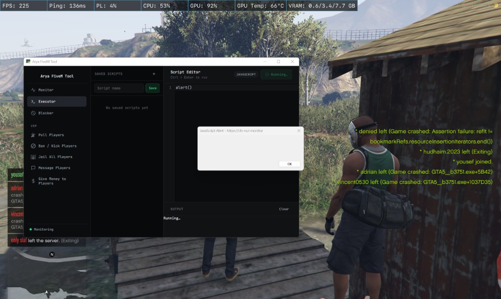

# Arya FiveM Tool

Open-source FiveM devtools panel. Run JS in NUI, watch traffic, block requests, and inspect resources — all from one local window.



## Quick start

```bash
pip install -r requirements.txt
python main.py
```

1. Open FiveM and join a server
2. Run the tool and wait for **Ready**

Requires Python 3.10+ and Windows.

## What it does

FiveM's NUI runs in Chromium and exposes Chrome DevTools on `localhost:13172`. This tool connects to that debug port over CDP (Chrome DevTools Protocol) — no DLLs, no external hooks.

- **Monitor** — live NUI/network traffic
- **Executor** — write and run JavaScript in the game UI
- **Debug** — list NUI targets, dump HTML/JS, inject into specific resources
- **Blocker** — block URLs by pattern
- **vRP tools** — server-specific player utilities

Injection targets the CitizenFX root UI iframe, so your code runs in the same context as menus, HUD, and NUI fetch calls.

## Troubleshooting

- **Waiting for FiveM** — open FiveM and join a server first
- **Panel won't open** — install [WebView2](https://developer.microsoft.com/microsoft-edge/webview2/)
- **Injection fails** — make sure you're in a server with the root UI loaded
- **Port in use** — close any other copy of the tool
